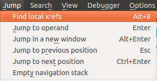
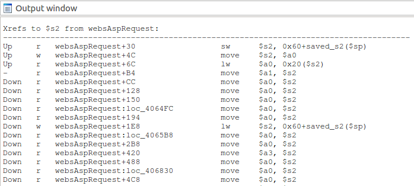
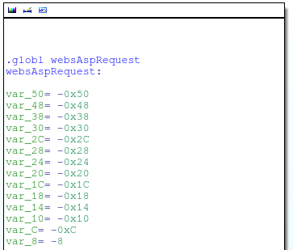
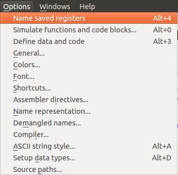
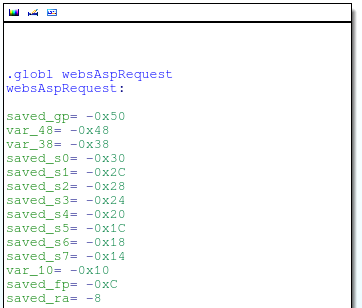

IDA Plugins
===

Collection of IDA plugins that I've written to help ease RE work. Just drop them into IDA's *plugins* directory.

codatify.py
-----------

What it does: 

  * Defines ASCII strings that IDA's auto analysis missed
  * Defines functions/code that IDA's auto analysis missed
  * Converts all undefined bytes in the data segment into DWORDs (thus allowing IDA to resolve function and jump table pointers)

Blob of data before running codatify:

Running codatify:

Blob of data after running codatify:

localxrefs.py
-------------

What it does:

  * Finds references from within the current function to any highlighted text

Here's some MIPS code. Where does that $s2 register get set?

Running localxrefs:

All references to $s2 in the current function are clearly listed:

mipslocalvars.py
----------------

What it does:

  * Names stack variables used by the compiler for storing registers on the stack, simplifying stack data analysis (MIPS only)

A function's stack layout before running mipslocalvars:

Running mipslocalvars:

The function's stack layout after running mipslocalvars:

