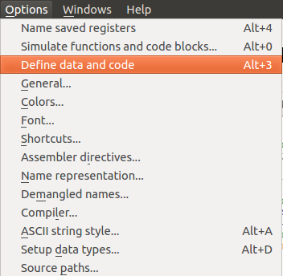

codatify.py
===========

Features
--------

  * Defines ASCII strings that IDA's auto analysis missed
  * Defines functions/code that IDA's auto analysis missed
  * Converts all undefined bytes in the data segment into DWORDs (thus allowing IDA to resolve function and jump table pointers)

Usage
-----

Blob of data before running codatify:

Running codatify:

Blob of data after running codatify:

Installation
------------

Just copy codatify.py into your IDA *plugins* directory.
