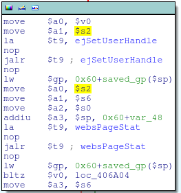
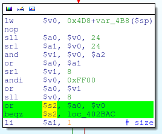

localxrefs.py
=============

Features
--------

  * Finds references to any selected text from within the current function

Usage
-----

Here's some MIPS code. Where does that $s2 register get set?

Running localxrefs:

All references to $s2 in the current function are clearly listed:

And, these references can be highlighted in the disassembly view by running *localxrefs.highlight()* in IDA's Python terminal:

(To un-highlight, run *localxrefs.unhighlight()*)

Installation
------------

Just copy localxrefs.py into your IDA *plugins* directory.
