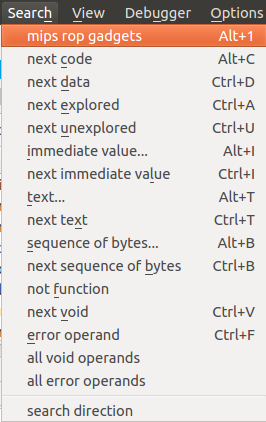
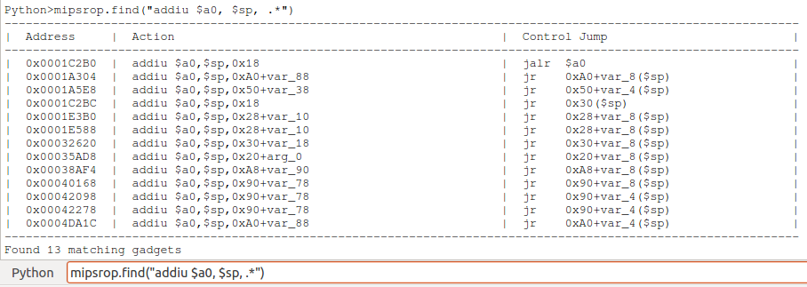
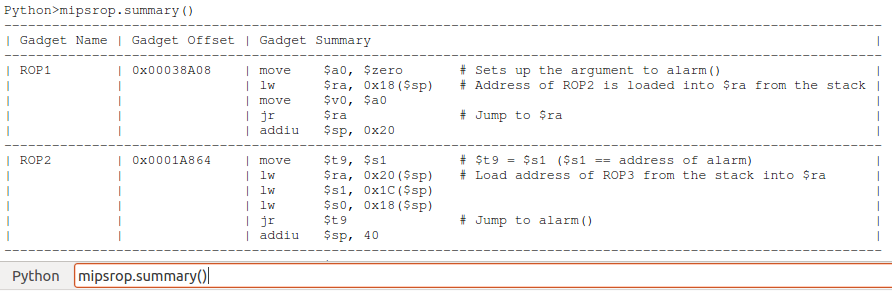

mipsrop.py
==========

Features
----------

  * Allows you to search for suitable ROP gadgets in MIPS executable code
  * Built-in methods to search for common ROP gadgets

Running mipsrop:

Searching for ROP gadgets that put a stack address into the $a0 register:

Listing a summary of marked ROP gadgets in the current IDB:

Use *mipsrop.help()* to see all available options!

Installation
------------

Just copy mipsrop.py into your IDA *plugins* directory.
